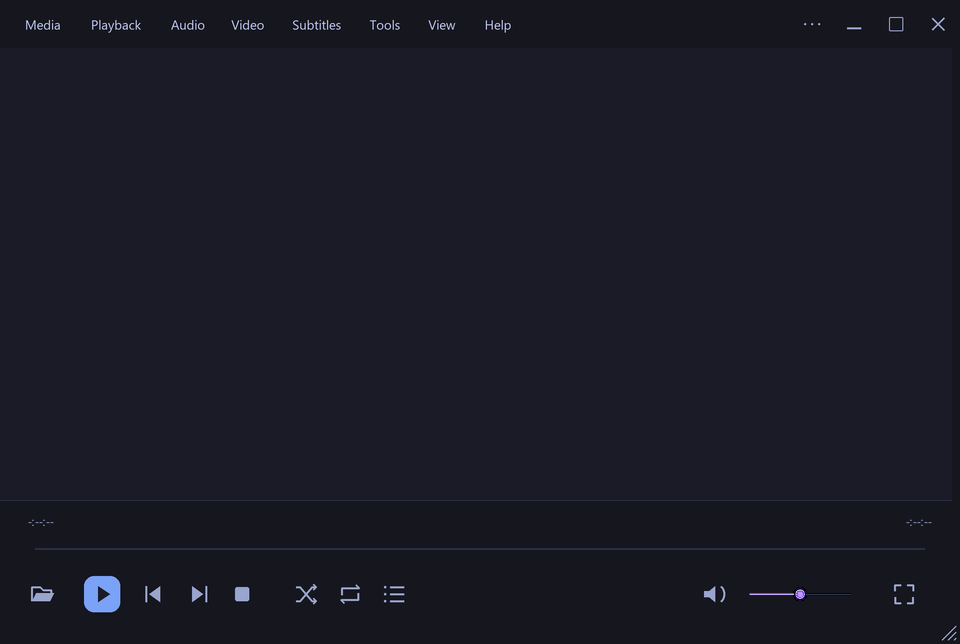

# Tokyo Night Dark for VLC

A VLC skin using the Tokyo Night palette, with a plain video area, horizontal menu row, resizable player, matching playlist, and fullscreen controls.



## Download and install

[Download the complete bundle](https://raw.githubusercontent.com/ChromedomeV12/vlc-tokyo-night-skin/main/dist/Tokyo-Night-VLC.zip) or [download the skin only](https://raw.githubusercontent.com/ChromedomeV12/vlc-tokyo-night-skin/main/dist/Tokyo-Night-Dark.vlt).

**Windows:** Extract the bundle and double-click `Try-Tokyo-Night.cmd`. This opens a separate VLC instance without saving changes to your interface preferences. Keep the launcher beside the `.vlt` file. You can also drop a media file onto the launcher.

**Make it the default:** In VLC, open **Tools → Preferences → Interface → Use custom skin**, choose `Tokyo-Night-Dark.vlt`, save, then fully quit and reopen VLC. Keep the skin file at the selected location.

**Linux:** Select the `.vlt` file in VLC's Interface preferences. Your VLC build must include Skins2 support. The Windows launcher is not needed.

To return to the standard interface, open Preferences, select **Use native style**, save, and restart VLC.

## Compatibility

| Platform | Status |
| --- | --- |
| Windows | Loading and video playback verified with VLC 3.0.23 |
| Linux with Skins2 | Expected to work; not tested |
| macOS | VLC does not support custom Skins2 skins |

The `.vlt` contains XML and PNG assets and uses VLC's installed default font. File dialogs, popup menus, and Preferences retain VLC or system styling. Controls have fixed pixel dimensions and may appear small on high-density displays.

## Controls and menus

- Top row: Media, Playback, Audio, Video, Subtitles, Tools, View, Help, the full VLC menu, and window controls.
- Bottom row: open, play/pause, previous, next, stop, shuffle, loop playlist, playlist toggle, mute, volume, and fullscreen.
- Drag the title-bar space to move the window; double-click it to maximize or restore. Drag the right edge to change width, the bottom edge to change height, or the larger bottom-right grip to change both. These resize controls also work on the playlist. The player defaults to 960 × 644, with a minimum of 800 × 470. Skins2 does not provide top/left edge resize actions.
- Double-click a playlist entry to play it. The playlist includes add, remove, save, and scroll controls.
- In fullscreen, press **I** or click the middle mouse button to toggle the controller. **F / Esc** enters or leaves fullscreen; **Space** toggles playback.

**Subtitles:** The button opens VLC's full menu. With a video loaded, choose **Subtitle** to add a subtitle file or select a track. The Skins2 command API has no dedicated subtitle-popup action. The menu row uses supported skin actions and does not reproduce every command in VLC's native menu bar. Media-dependent settings require loaded media.

See [the bundled instructions](dist/README.txt) for more details.

## Build and customize

Python 3.9 or later is required.

```sh
python -m pip install -r requirements.txt
python tools/build_skin.py
```

The build script generates `skin/theme.xml` and PNG assets, validates bitmap references and image files, and writes the `.vlt` and ZIP bundle into `dist/`. It also validates against VLC's `skin.dtd` when a local copy is found.

On Windows, the generator uses Segoe UI for rasterized menu labels. On Linux, it looks for DejaVu Sans. A different font can slightly change the labels' appearance; no font files are packaged in the skin.

```sh
python tools/build_skin.py --font /path/to/font.ttf --vlc-dir /usr/share/vlc
```

Edit `C` in the build script to change the palette, `MENUS` and `popup(...)` calls to change the menu row, or `controls(...)` to adjust playback-control positions. Rebuild afterward. Manually editing files in `skin/` is also possible, but regeneration overwrites the generated files. Package manual edits with:

```sh
tar -czf dist/Tokyo-Night-Dark.vlt -C skin .
```

The screenshot in `docs/preview.png` is captured from VLC and is updated separately from the build.

To check resizing in a separate VLC instance on Windows without saving preferences:

```sh
python tools/verify_resize_windows.py
python tools/verify_resize_windows.py --media path/to/test-video.mp4
```

This integration check sends mouse messages to its own VLC windows and verifies right-edge, bottom-edge, and corner drags in both directions, including minimum sizes, for the player and playlist.

For a short resize performance measurement, run `python tools/verify_resize_windows.py --benchmark --media path/to/test-video.mp4`. This reports mouse-message handling latency, not display frame rate. Backgrounds use large solid tiles because VLC's default mosaic mode draws every tile individually; tiny tiles make resizing expensive.

To check the seek bar's fill and handle alignment at multiple positions and window widths:

```sh
python tools/verify_seek_windows.py --media path/to/test-video.mp4
```

This check uses a seekable video, pauses playback, and examines VLC's rendered pixels after seeking. It also checks clicks above and below the thin track.

Planned work and priorities are tracked in [TODO.md](TODO.md).

## Credits

- Palette: [Tokyo Night](https://github.com/tokyo-night/tokyo-night-vscode-theme), originally by enkia.
- Player and skin format: [VideoLAN VLC](https://www.videolan.org/vlc/) and its [skin documentation](https://images.videolan.org/vlc/skins2-create.html).
- Layout, icon artwork, and build script were created for this project.

This is an unofficial community skin, not a VideoLAN product. Original project code and artwork are available under the [MIT License](LICENSE).
