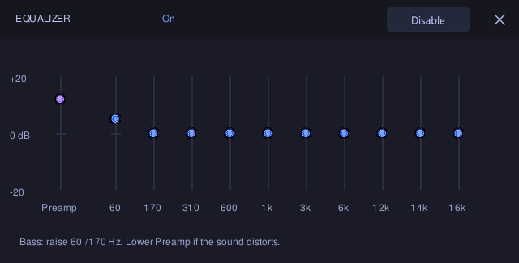
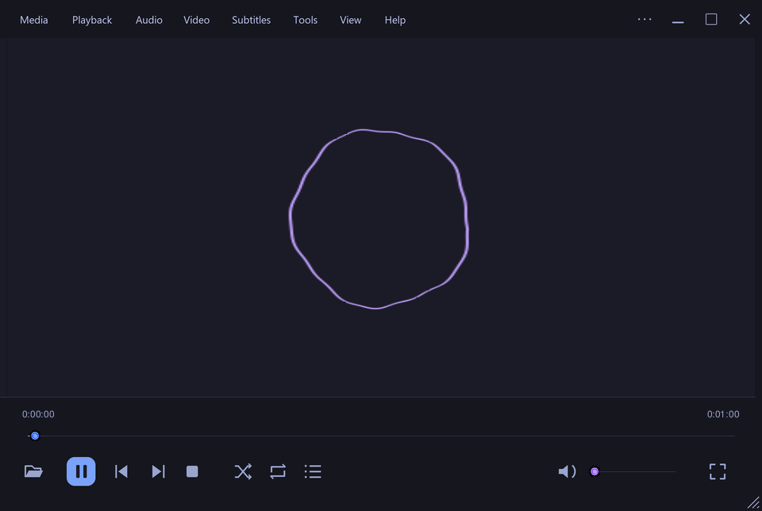

# Music controls and Tokyo Night visuals

## Equalizer and bass boost

Open **Audio → Equalizer / Bass Boost** (also available under Tools). Click Enable. This panel controls VLC's own ten-band equalizer and preamp.

Start with Preamp at 0 dB or below, then raise 60 Hz and 170 Hz slightly for bass. Lower Preamp to leave room for the boost if the sound becomes harsh or distorted. The middle tick is 0 dB; the top and bottom are +20 and -20 dB. Disable bypasses the effect. VLC may initially use its existing +12 dB preamp setting, so check it before enabling.



## Visualizations

The complete ZIP includes **Waves** (blue `#7aa2f7`) and **Orbit** (purple `#bb9af7`) projectM presets. Both use the Tokyo Night Dark background (`#1a1b26`) and projectM's built-in audio-reactive waveforms. The background covers wide windows and keeps its color during preset transitions. There are no external textures or shaders.

**Try immediately on Windows:** extract the whole ZIP and drop an audio file onto `Try-Tokyo-Night-Music.cmd`. It starts a separate VLC instance with the visualization enabled. The ordinary skin launcher continues to use your existing visualization preference.

**Use from VLC's own menu:**

1. Open Preferences and select **All** settings.
2. Go to **Audio → Visualizations → projectM** and select the included `visualizations` directory as the preset path. Set texture size to **512** for these simple presets.
3. Save and fully restart VLC.
4. Play music, open **Audio → Audio Options → Visualizations → projectM**. Choose **Disable** in the same submenu to turn it off.

With both presets in the directory, VLC's projectM integration cycles them approximately every 30 seconds. To keep one effect, point projectM at `visualizations/waves` or `visualizations/orbit` instead. Those subdirectories each contain only the corresponding preset.



**Customize:** edit the `.milk` files or `tools/build_visualizations.py` and regenerate them. `wave_r`, `wave_g`, and `wave_b` use RGB values divided by 255; `fWaveScale` controls movement strength. Both sets of `shapecode_0_r/g/b` and `shapecode_0_r2/g2/b2` specify the background. Keep its additive blending and zero feedback (`fDecay=0`) together so transitions do not darken the canvas. Keep global preset fields before shape fields for VLC's legacy projectM parser. Fully restart VLC after replacing presets to reload cached copies.

**Restore:** select Disable in Audio → Visualizations. Reset the projectM preset path to its previous folder (or clear it for VLC's default). The installer does not turn projectM on globally, so normal video playback keeps the existing behavior.

These presets were tested in VLC 3.0.23 on Windows, including embedded rendering, animation and resizing. Linux needs a VLC build with both Skins2 and projectM and has not been tested. The presets are separate from the `.vlt`; selecting a skin alone cannot install or configure a visualizer. Other visualization engines retain their own colors.

## Timed track changes

The helper `tools/make_timed_playlist.py` creates an XSPF playlist that VLC plays directly. It uses native per-track start and stop points. No background scheduler or extra playback process is needed.

Create a CSV with `file,start,stop` columns; `title` is optional:

```csv
file,start,stop,title
music/first song.mp3,0:12,1:42,First segment
music/second song.flac,0,2:00,Second segment
```

Paths are relative to the CSV. Times can be seconds, MM:SS, or HH:MM:SS; a blank stop means play to the end. Stop must be after start. The helper verifies that files exist but cannot verify their duration, so use points within each track.

```sh
python tools/make_timed_playlist.py tracks.csv set.xspf
```

Open `set.xspf` in VLC. It plays the selected portions in order and **cuts** to the next track. It does not create a crossfade or guarantee beat-accurate/gapless changes. It refuses to overwrite an existing output file. Generated playlists contain your local media paths; keep personal playlists out of the public repository.

## Crossfades and simple DJ transitions

VLC 3.0's normal playlist plays one track at a time. The skin can expose its equalizer, speed and playlist controls, but cannot turn that player into two overlapping decks.

A companion using two LibVLC players could implement fades, but would introduce a second playback interface, synchronization and audio-device management. That is a poor fit for this project's preference for native VLC behavior and low overhead, so it is not included.

For automatic fades, [Mixxx Auto DJ](https://manual.mixxx.org/2.5/en/chapters/djing_with_mixxx#auto-dj) already provides overlapping playback, configurable crossfade lengths and intro/outro cues. Mixxx's equalizers, crossfader and sync controls also support simple manual mixing. It is a separate application; this VLC skin does not install or control it.

References: [VLC audio effects](https://docs.videolan.me/vlc-user/desktop/3.0/en/basic/settings/adjustmentsandeffects.html), [VLC input timing options](https://videolan.videolan.me/vlc-3.0/libvlc-module_8c.html), [projectM preset guide](https://github.com/projectM-visualizer/projectm/wiki/Preset-Authoring-Guide).
